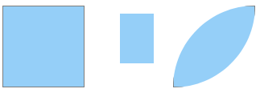
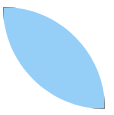
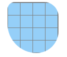
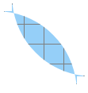
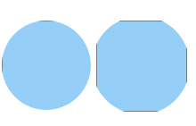
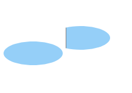

### clip-path

**`clip-path`** 是[CSS](https://developer.mozilla.org/zh-CN/docs/Web/CSS) 属性创建一个裁剪区域，该区域设置应显示元素的哪一部分。区域内的部分显示，区域外的隐藏。

- 参考链接
  
  - [在线生成path-clip](https://bennettfeely.com/clippy/)
  - [CSS3/SVG clip-path路径剪裁遮罩](https://www.zhangxinxu.com/wordpress/2014/12/css3-svg-clip-path/l)
  
- 兼容性

  - firefox(目前版本76, 官网上说六周更新一个版本): 54+
  - chrome(目前版本74): 24+
  - **IE不支持**
  - safar(目前版本12.1.1): 8+
  - opera: 15+

- 使用

  - `clip-path` 是用来代替 `clip` 的；`clip` 的用法这里不赘述了；`clip-path` 是通过遮掩、隐蔽达到剪裁的形状；其剪裁的路径是通过矢量来描述的；其矢量的表达方法主要有:

    1. inset: inset(上边距，右边距，下边距，左边距  **round**  border-radius{1,4} )可以剪裁图像的长宽，以及圆角;

       实例1：

       

       可以看见

       最左侧是没有剪裁过的长宽为100px的正方形，border是1px的solid；

       中间是将上左下右分别剪裁了 `inset( 10px 20px 30px 40px)`；其 **borde 没有** 了

       最右侧是没有剪裁上下左右；但是做了圆角 `inset( 0 0 0 0 round 200px 0px 200px 0px)`; 在左上角，右下角剪裁了 **直径为200px** 的圆角;

       

       实例2:

       `inset( 0 0 0 0 round 0px 200px 0px 200px )`

       

       `inset( 0 0 0 0 round 100px 200px 300px 400px)`

       

       这两张图片都是长宽为100px的正方形；其中小格子的长宽是25px；

       **第一张图**设置长宽为右上角和左下角的圆角为200px；由于直径超过了100px(正方形的长宽)；则直接取直径为100px；

       **第二张图**由于四个边角都有设置圆角，则每个圆角的最大半径为 50px; 所以取最大圆角 400px 为半径为 50px的圆角；由于其缩小了 ( 400 / 50 ) = 8 倍；其余的等比例缩小 8 倍；则实际显示圆角半径从左上角依次是: 12.5px, 25px, 37.5px, 50px;

       

       实例3:

       `inset(10px 10px 10px 10px round 0px 200px 0px 200px)`; 这种设置了圆角半件大于本身长宽的，并且有剪裁的，会出现不规则图形；

       

       

    2. circle: 

       

        ```html
   <!DOCTYPE html>
       <html lang="en">
   
       <head>
     <meta charset="UTF-8">
         <title>daily_12_path_clip</title>
     <style>
         .container {
           width: 100px;
           height: 100px;
           background: #2da0f2;
           opacity: 0.5;
           display: inline-block;
           border: 1px solid #000;
         }
         .circle {
           clip-path: circle(50px at 50px 50px);
         }
         .circle1 {
           clip-path: circle(55px at 50px 50px);
         }
         </style>
       </head>
       
       <body>
         <div class="container circle"></div>
         <div class="container circle1"></div>
       
       </body>
       
       </html>
        ```
    
       
    
    3. ellipse 椭圆
    
       
    
       ```html
       <style>
         .container {
           width: 100px;
           height: 100px;
           background: #2da0f2;
           opacity: 0.5;
           display: inline-block;
           border: 1px solid #000;
         }
         .ellipse {
           clip-path: ellipse(50px 20px);
         }
         .ellipse1 {
           clip-path: ellipse(50px 20px at 25px 25px);
         }
       </style>
         <div class="container ellipse"></div>
         <div class="container ellipse1"></div>
       ```
    
       
    
    4. polygon 多边形
    
       
    
        ```html
       <style>
         .container {
           width: 100px;
           height: 100px;
           background: #2da0f2;
           opacity: 0.5;
           display: inline-block;
           border: 1px solid #000;
         }
         .polygon {
           clip-path: polygon(50px 20px, 50px 80px, 80px 20px);
         }
         .polygon1 {
           clip-path: polygon(50px 20px, 50px 80px, 70px 20px, 90px 80px, 90px 20px);
         }
       </style>
       
         <div class="container polygon"></div>
         <div class="container polygon1"></div>
        ```
    
       
    
    


