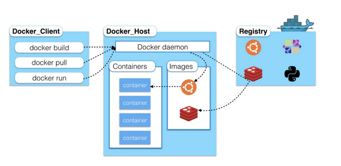

#### Docker基础

- 参考

  - [Docker快速开始与实践](https://juejin.im/post/5e970731e51d4546d4397dd6)
  - [是时候Docker](https://juejin.im/post/5d8c169c6fb9a04e0855a141)
  - [前端docker入门](https://juejin.im/post/5e7c526451882535df649ab4)
  - [docker从入门到实践](https://yeasy.gitbook.io/docker_practice/)

- #### Docker 架构

  

  - **Docker daemon**
- **Client（ Docker客户端）**
  
  - **Container（容器）**
- **Registry**
  


- #### `docker search <keyword>`：搜索有关于 keyword 的相关镜像，搜索结果有5列

  - NAME:镜像仓库名称。
  - DESCRIPTION:镜像仓库描述。
  - STARS：镜像仓库收藏数，表示该镜像仓库的受欢迎程度，类似于 GitHub的 stars0
  - OFFICAL:表示是否为官方仓库，该列标记为[0K]的镜像均由各软件的官方项目组创建和维护。
  - AUTOMATED：表示是否是自动构建的镜像仓库

  

- ##### `docker pull <image>[:version]`：下载指定镜像

- ##### `docker images` 列出镜像

  - REPOSITORY：镜像所属仓库名称。 
  - TAG:镜像标签。默认是 latest,表示最新。
  - IMAGE ID：镜像 ID，表示镜像唯一标识。 
  - CREATED：镜像创建时间。
  - SIZE: 镜像大小。

  

- ##### `docker rmi <image>` 删除镜像

  - 删除镜像必须保证没有使用该镜像所创建的容器(包括正在运行的容器，和已经创建但被停止的容器；可使用 `docker ps -a`查看全部的容器)
  
  - 在删除镜像的时候可能会出现错误 `image is referenced in multiple repositories`；可查看是否是要删除的镜像同时指向了两个仓库。比如使用某个镜像创建了另一个镜像 (使用`FROM`命令)；这个时候先删除镜像名；比如下例
  
    ```shell
    docker rmi nginx;
    ```
  
    

#### Container 基础

- ##### `docker run` 新建并启动一个容器

  - `-d` 表示后台运行
  - `-P` 表示端口随机映射
  - `-p` 表示指定端口映射
    - `-- ip:hostPort:containerPort` 开放容器端口(containerPort)到宿主机端口(hostPort)
    - `-- ip::containerPort`
    - `-- hostPort:containerPort`
    - `-- containerPort`
  - `--net`选项：指定网络模式，该选项有以下可选参数：
    - `--net=bridge`: 默认选项，表示连接到默认的网桥。
    - `--net=host`: 容器使用宿主机的网络
    - `--net=container:NAME-or-ID`：让 Docker 将新建容器的进程放到一个已存在容器的网络栈中，新容器进程有自己的文件系统、进程列表和资源限制，但会和已存在的容器共享 IP 地址和端口等网络资源，两者进程可以直接通过 lo 环回接口通信。
    - `--net=none`：让 Docker 将新容器放到隔离的网络栈中，但是不进行网络配置。之后，用户可以自己进行配置。

- ##### `docker build [option] PATH|URL|-`  使用Dockerfile 创建一个镜像

  - **--build-arg=[] :**设置镜像创建时的变量；
  - **--cpu-shares :**设置 cpu 使用权重；
  - **--cpu-period :**限制 CPU CFS周期；
  - **--cpu-quota :**限制 CPU CFS配额；
  - **--cpuset-cpus :**指定使用的CPU id；
  - **--cpuset-mems :**指定使用的内存 id；
  - **--disable-content-trust :**忽略校验，默认开启；
  - **-f :**指定要使用的Dockerfile路径；
  - **--force-rm :**设置镜像过程中删除中间容器；
  - **--isolation :**使用容器隔离技术；
  - **--label=[] :**设置镜像使用的元数据；
  - **-m :**设置内存最大值；
  - **--memory-swap :**设置Swap的最大值为内存+swap，"-1"表示不限swap；
  - **--no-cache :**创建镜像的过程不使用缓存；
  - **--pull :**尝试去更新镜像的新版本；
  - **--quiet, -q :**安静模式，成功后只输出镜像 ID；
  - **--rm :**设置镜像成功后删除中间容器；
  - **--shm-size :**设置/dev/shm的大小，默认值是64M；
  - **--ulimit :**Ulimit配置。
  - **--tag, -t:** 镜像的名字及标签，通常 name:tag 或者 name 格式；可以在一次构建中为一个镜像设置多个标签。
  - **--network:** 默认 default。在构建期间设置RUN指令的网络模式

- ##### `docker ps` 列出容器

  - CONTAINER_ID：表示容器 ID。
  - IMAGE:表示镜像名称。
  - COMMAND：表示启动容器时运行的命令
  - CREATED：表示容器的创建时间。 
  - STATUS：表示容器运行的状态。UP表示运行中， Exited表示已停止。
  - PORTS:表示容器对外的端口号。
  - NAMES:表示容器名称。该名称默认由 Docker自动生成，也可使用 docker run命令的-name选项自行指定

- ##### `docker stop <container id> [container id]...` 停止容器

- ##### `docker kill <container id>` 强制停止容器

- ##### `docker rm <container id>` 删除容器

- ##### `docker start <container id>` 启动一个容器(不新建)

- ##### `docker inspect <container id>` 查看容器所有信息

- ##### `docker container logs <container id>` 查看容器日志

- ##### `docker top <container id>` 查看容器里的进程

- ##### `docker exec <container id>` 进入容器

  - `docker exec -it f0b1c8ab3633 /bin/bash`
  - 使用docker exec命令用于进入一个正在运行的docker容器。如果docker run命令运行容器的 时候，没有使用-it参数，就要用这个命令进入容器。一旦进入了容器，就可以在容器的 Shell  执行命令了


### 一个小例子

- 拉取nginx镜像: `docker pull nginx`
- 查看拉取的镜像: `docker images`
- 运行一个容器: `docker run -d -p 4200:80 nginx (docker run -p 4200:80 -v /home/mimee/project/html:/usr/share/nginx/html --name nginxhtmls -d nginx; 该命令表示把宿主机中的/home/mimee/project/html目录映射到容器的/usr/share/nginx/html目录中去)`
- 查看运行的网页( http://host:4200 ); 如果是在阿里云上部署，记得设置安全政策
- 进入运行的容器的bash: `docker exec -it b624806115b0 /bin/bash `
- 寻找 ngnix的html目录: `find . -name 'ngnix'`
- 进入该目录: `cd /usr/share/nginx/html`
- 退出容器: `exit`
- 将某个html复制过去: `docker cp text.html b624806115b0`://usr/share/nginx/html/index.html`
- 查看运行的网页( http://host:4200 ); 
- 查看正在运行的容器: `docker ps`
- 停止正在运行的容器: `docker stop b624806115b0`
- 查看所有容器: `dockers ps -a`
- 删除容器: `docker rm  b624806115b0`
- 查看所有容器: `dockers ps -a`
- 删除创建的镜像: `docker rmi ab96abaa3937`
- 查看镜像: `docker images`


### Dockerfile

- 先来一个例子

  ```shell
  # 指定一个目录创建 Dockerfile
  vim Dockerfile;
  # 在file中输入下列信息；保存；
  FROM nginx
  RUN echo '  This is Tuling Nginx!!! ' > /usr/share/nginx/html/index.html
  # 创建一个image镜像；-t 表示镜像名字； . 表示 Dockerfile文件路径
  docker build -t nginx:tuling .
  # 启动创建的镜像；-d 表示后台运行；-p 表示端口映射；该命令表示启动nginx服务；将80端口映射至4200端口
  docker run -d -p 4200:80 nginx:tuling
  # 打开网页；打开4200端口页面即可看见This is Tuling Nginx!!!；
  ```

- Dockerfile 常用指令

  | 指令        | 描述                                                         | 例                                                           |
  | ----------- | ------------------------------------------------------------ | ------------------------------------------------------------ |
  | FROM        | 构造的新镜像是基于哪个镜像的                                 | `FROM nginx`                                                 |
  | RUN         | 构建新镜像时运行的shell命令                                  | `RUN yum install httpd`                                      |
  | MAINTAINER  | 维护者信息                                                   | `MAINTAINER yanglin`                                         |
| CMD         | 运行容器时执行shell命令                                      | `CMD /usr/sbin/sshd -D`                                      |
  | EXPOSE      | 指定于外界交互的端口即容器在运行时监听的端口                 | `EXPOSE 8081`                                                |
| ENV         | 设置容器内环境变量                                           | `ENV MYSQL_ROOT_PWD 123`                                     |
  | ADD         | 拷贝文件或者目录到镜像，如果是URL或者压缩包会自动下载或者自动解压 | `ADD /home/*`                                                |
  | COPY        | 拷贝文件或者目录到镜像                                       | `copy /home /`                                               |
  | ENTRYPOINT  | 运行容器时执行的shell命令                                    | `ENTRYPOINT ["/bin/bash","-c","/startup.sh"]`                |
  | VOLUME      | 指定容器挂载点到宿主机自动生成的目录或者其他容器             | `VOLUME ["/path/to/dir"]`                                    |
  | USER        | 为RUN,CMD,ENTRYPOINT执行命令指定运行用户                     |                                                              |
  | WORKDIR     | 为RUN,CMD,ENTRYPOINT,COPY和ADD设置工作目录                   | `WORKDIR /data`                                              |
  | HEALTHCHECK | 健康检查                                                     | `HEALTHCHECK --interval=5m --timeout=3s CMD curl -f http://localhost/` |
  | ARG         | 在构建镜像时指定一些参数                                     | `FROM centos:6ARG age=100`                                   |
  
  
  
  


