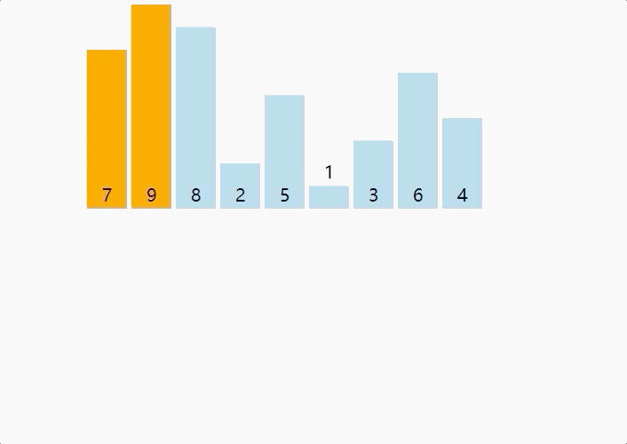

### 选择排序

插入排序的性能相较于冒泡排序和选择排序更优；原因在于，插入排序的时间复杂度很大程度上是依赖样本质量的；但是按照样本质量最差来求时间复杂度；是与冒泡排序和选择排序一样的。

- ##### 原理：插入排序就像玩扑克牌的时候，给扑克牌从小到大排序；从左到右；把每一张牌都放在左边不大于其自己右边不小于其自己的位置

  

- ##### 代码

  ```java
  
  public class InsertSort {
      public static void main (String[] arg) {
          System.out.println("Select Sort");
          int[] array = {1, 56, -19, 211, 29, 59};
          InsertSort(array);
          printArray(array);
      }
  
      public static void InsertSort(int[] arr) {
          for (int i = 1; i < arr.length; i++) {
              for( int j = i; j > 0; j --) {
                  if (arr[j] < arr[j - 1]) {
                      swap(arr, j, j - 1);
                  }
              }
          }
      }
  
      public static void swap (int[] arr, int index1, int index2) {
          arr[index1] = arr[index1] ^ arr[index2];
          arr[index2] = arr[index1] ^ arr[index2];
          arr[index1] = arr[index1] ^ arr[index2];
      }
  
      public static void printArray (int[] arr) {
          for(int i = 0; i < arr.length; i++) {
              System.out.println(arr[i]);
          }
      }
  }
  ```

- ##### 算法总结

  - 时间复杂度： O(n<sup>2</sup>)
  - 空间复杂度:：O(1)
  - 稳定性：稳定

