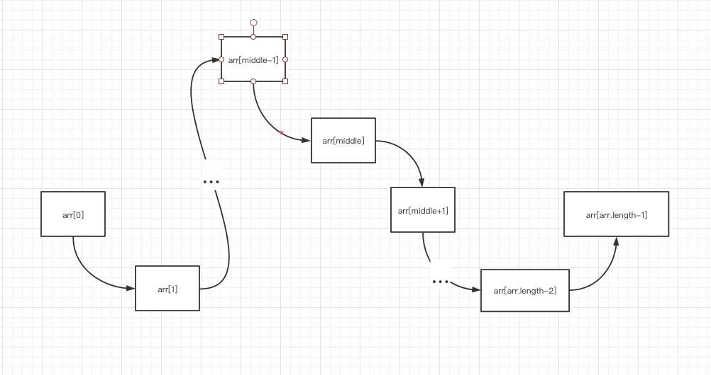

### 局部最小值

局部最小值意思是在一个数组 `arr` 中，存在一个数，其索引为 ` i`，有 `arr[i - 1] > arr[i] && arr[i + 1] > arr[i]`；则称 `arr[i]`为局部最小值；左右边界只需要满足上面条件的一个即可；

- 求局部最小值思路

  1. 查看边界是否满足条件满足则返回；

  2. 如果边界不满足条件，则可知该数组的数值分布情况有一下几种走势：

     图1:

     

     图2:

     

     图3:

     

     图4:

     

  3. 从上面走势可知， 图4可直接返回 middle； 图3中，在 `arr[middle]` 和 `arr[arr.length - 1]` 中必定存在局部最小； 图2中，在`arr[middle]`和 `arr[0]`中必定存在局部最小；图1中，在 `arr[middle]` 和 `arr[arr.length - 1]` 中必定存在局部最小，在`arr[middle]`和 `arr[0]`中必定存在局部最小；

  4. 由此可根据情况，将 函数边界值(left, right)改成 middle；重复步骤1即可;

  

- ##### 代码: 采用二分法来解题

  ```JAVA
  package first;
  
  public class BinarySearch {
      public static void main (String[] arg) {
          System.out.println("Select Sort");
          int[] array = {1001, 206, 19, 21, 29, 59};
          int index3 = MinInPart(array);
          System.out.println(index3);
      }
  
      //局部最小值问题
      public static int MinInPart(int[] arr) {
          if (arr.length == 0 || arr == null) {
              return -1;
          }
          int index = -1;
          int left = 0;
          int right = arr.length - 1;
  
          if (arr.length == 1 || arr[left] < arr[left + 1]) {
              return left;
          }
  
          if (arr[right] < arr[right - 1]) {
              return right;
          }
  
          while (left < right) {
              int middle = (left + right) >>> 1;
  
              if (arr[middle] < arr[middle - 1] && arr[middle] < arr[middle + 1]) {
                  index = middle;
                  break;
              }
  
              if ( arr[middle] > arr[middle - 1]) {
                  right = middle;
              }else if (arr[middle] <= arr[middle + 1]) {
                  left = middle;
              }
          }
  
          return index;
      }
  
  }
  
  ```

  