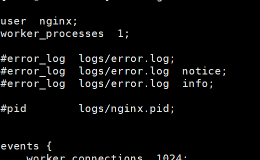
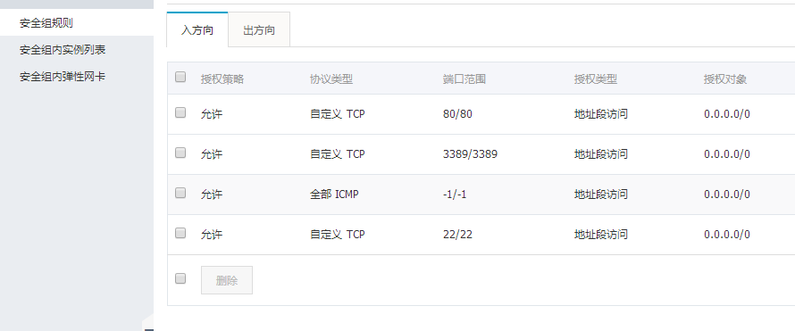
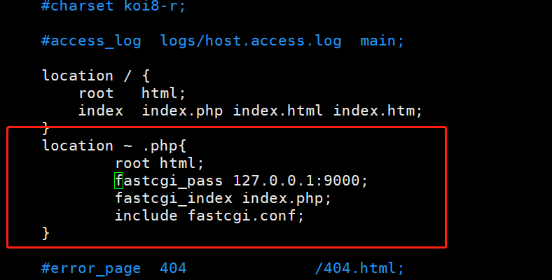

- # 连接
    + ## 购买阿里云
    + ## 打开购买阿里云的实例  
    
    + 在 [更多] 里可以设置远程连接密码，和用户登陆密码
    
    + 重启实例( 设置完后一定要重启，否则不会生效 )
    + 然后就可以远程连接了。

- # 向服务器中拷贝文件
    + ## 连接完成后如下图   
    
    + ## 创建一个目录来存储文件  
        `mikdir /home/mimee/tools -p`, 在该目录下创建 tools 文件夹。
    + ## 安装 rz 命令，该命令用于可以在window系统下向linux系统移动文件  
        `yum install lrzsz -y`
    + ## 安装完成后，使用 `rz -y` 就可上传文件了。  
        

- # 上传文件( 都是linux文件，以 tar.gz 为后缀名)
    + libiconv 
    + libmcrypt
    + mcrypt
    + mhash
    + mysql
    + nginx
    + php

- # 安装 nginx 之前需要两个基础包( pcre, opens )
    + 安装 pcre `yum install pcre pcre-devel -y`
    + 安装 opens `yum install openssl openssl-devel -y`
    + 创建一个 Nginx 账户来管理 Nginx；
        * `useradd nginx -s /sbin/nologin -M` 创建账号
        * `tail -l /etc/passwd` 查看账号是否创建
    + 解压 Nginx
        * `tar xf filename`
        * `cd filename`
    + 编译型的文件按照 *配置--编译--编译安装* 来处理
        * 配置信息，可以使用 `./configure --help` 查看更加详尽的配置命令
            ```
                ./configure --user=nginx 
                            <!-- 刚刚添加的nginx账户来管理这个Nginx -->
                            --group=nginx 
                            <!-- 设定为nginx组 -->
                            --prefix=/application/nginx-1.6.3/
                            <!-- 安装路径  -->
                            --with-http_stub_status_module\
                            <!-- 安装信息模块，可以查看丢包率 -->
                            --with-http_ssl_module
            ```
        * 执行 `make` 命令
        * 执行 `make install` 命令 ————安装拷贝文件
        * 创建一个软链接，便于管理 `ln -s /application/nginx-1.6.3/ /application/niginx`
    + 启动 nginx 服务
        * `/application/nginx/sbin/nginx -t`  
            `-t` 检查 Nginx 的配置语法
            - 出现了错误 `[emerg]: getpwnam(“nginx”) failed`  
                1. 在安装目录下的 `/conf/nginx.conf` 查看 `user` 是不是 `nobody` 将其改为 `nginx`
             
                2. 检查是否存在 `nginx` 这个用户组，没有就添加
        * `/application/nginx/sbin/nginx` 启动
    + 确定是否启动(查看进程)
        
    * ` ps -ef | grep nginx`
        
    + 如果安装 nginx 被安装完，仍然不能访问则考虑是否添加了安全规则，开放了80端口。  

    
- # 域名绑定
- # mysql安装
    + ## 二进制安装方式  
        是相对源码安装来说的; 比如 mysql-5.5.32-linux2.6-x86_64.tar.gz, 如果是源码包则没有 linux2.6-x86_64 这一部分。
        二进制包相对于源码包来说，就是相对已经编译好的包( 相对于你自己的电脑 )；直接都安装不需要经过 make 这个步骤；也不用 make install；直接把文件拷过去解压缩就可以使用了。
    + ## 安装
        * ### 创建一个 mysql 用户来管理 mysql；
            - 创建一个组   
            `groupadd mysql`
            - 创建用户，不需要登陆，指定组为 mysql 的用户mysql  
            `useradd -s /sbin/nologin -M -g mysql mysql`
            - 查看是否创建成功  
            `tail -l /etc/passwd`
        * ### 解压 mysql  
        * ### `tar xf mysql-5.5.32-linux2.6-x86_64.tar.gz` 这里是二进制文件，所以不用 `make`，`make install`，可以直接移动。
        * ### 移动文件   
        `mv mysql-5.5.32-linux2.6-x86_64 /application/mysql-5.5.32`
        * ### 创建软连接  
        `ln -s /application/mysql-5.5.32 /application/mysql`
        * ### 切换至 `mysql/support-files` 目录下；该目录下有许多mysql的配置文件(.cnf 结尾)，需要把配置文件拷贝到 `etc` 目录去
        * ### 将配置文件拷贝到 etc 目录；配置文件有很多个；大小不一；这里拷贝一个小型的就可以；   
        `cp my-small.cnf /etc/my.cnf`  
        如果提示是否覆盖，选择覆盖。
        * ### 安装初始化 mysql 数据库的数据，就是 mysql 目录下的 data 那个目录。该目录保存了所以数据库( database )和表( table )  
            - #### 首先让之前创建的 mysql 组和用户来管理 mysql，这一步首先要授权  
                `chown -R mysql.mysql /application/mysql/` -R 表示包括 /application/mysql 的所有文件  
                通过 `ls -l` 查看是否授权成功
            - #### 在 data 目录下安装默认的 mysql 数据库  
                首先安装一下 tree 包，可以以树形的形态展示文件夹里的内容。 `yum install tree -y` --> 使用 `tree data`  
                安装默认 mysql 数据库 
                `/application/mysql/script/mysql_isntall_db`  运行 mysql_isntall_db 脚本  
                `--basedir=/application/mysql`  设置根目录  
                `--datadir=/application/mysql/data` 设置data目录  
                `--user=mysql`  设置管理用户 
                报错 `please install the following Perl modules`；    
                解决: `yum-y install autoconf`
                报错 `error while loading shared libraries: libaio.so.1: cannot open shared object file:`  
                解决: `yum install -y libaio`
            - #### 设置 mysql 的启动服务  
                拷贝 mysql目录下的 support-files/mysql.server 脚本到 /etc/init.d/mydqld 去。
                `cp /support-files/mysql.server /etc/init.d/mysqld`
            - #### 为 /etc/init.d/mydqld 添加可执行的权限
                `chmod +x /etc/init.d/mysqld`
            - #### 做一个默认的替换配置  
                `sed -i 's#/user/local/mysql#/application/mysql#g' /application/mysql/bin/mysqld_safe /etc/init.d/mysqld` 这是一个字符串替换命令，应为我们的 mysql 是安装在 application 下面的， g 是全局替换。这句话的意思是把在 /application/mysql/bin/mysqld_safe， /etc/init.d/mysqld 这两个文件中的 /user/local/mysql 替换成 /application/mysql；
            - #### 启动 mysql 服务   
                `/etc/init.d/mysqld start`
            - #### 查看进程是否启动了 MySQL   
                `ps -ef | grep mysql`
            - #### 查看端口来查看是否启动 mysql
                `netstat -an | grep :3306`
            - #### 登陆 mysql   
                `/application/mysql/bin/mysql -uroot -p` -uroot 表示 user 是 root( mysql 的默认用户名 ) -p 是表示密码( 默认密码为空 )
            - #### 将 mysql 设置为开机启动 
                添加: `chkconfig --add mysqld`  
                查看: `chkconfig --list mysqld`
            - #### 将全路径添加到环境变量里去
                添加: `echo 'export PATH=/application/mysql/bin:$PATH' >> /etc/profile`
                生效: `source /ect/profile`    
                查看: `tail -l /etc/profile`  
                查看环境变量: `echo $PATH`
                现在可以直接使用 `mysql -uroot -p` 登陆 mysql 了
            - #### 更改 mysql 密码  
                `mysqladmin -u root password 'new password'`

- # 安装php
    + ## 安装依赖包
        - `zlib-devel` 
        - `libxml2-devel` 
        - `libjpeg-devel` 
        - `libjpeg-turbo-devel` 
        - `libiconv-devel`
        - `freetype-devel` 
        - `libpng-devel` 
        - `gd-devel` 
        - `libcurl-devel` 
        - `libxslt-devel`
        
        `yum install zlib-devel libxml2-devel libjpeg-devel libjpeg-turbo-devel libiconv-devel -y`  
        `yum install freetype-devel libpng-devel gd-devel libcurl-devel libxslt-devel -y`

    + ## 安装 libiconv 包和 libmcrypt-devel 包
        * ### libiconv 包
            - 解压 `tar zxf libiconv-1.14.tar.gz`
            - 切换目录 `cd libiconv-1.14`
            - 配置参数 `./configure --prefix=/user/local/libiconv`
            - 编译 `make`
            - 编译安装 `make install`
            - 以下是配置阿里云的步骤，由于本身在阿里云，所以不用进行
                + `rpm -qa libiconv-devel`
                + `rpm -qa libiconv`
                + `yum install libmcrypt-devel -y`
                + `wget -O /etc/yum.repos.d/epel.repo http://mirrors.aliyun.com/repo/epel-6.repo`
            - `yum install libmcrypt-devel -y`
        * ### 安装 mhash 包
            `yum install mhash -y`
        * ### 安装 mcrypt 包
            `yum install mcrypt -y`
    + ## 安装编译 php   
        [安装php的编译配置](安装php的编译配置.txt)
        - ### 解压 php 安装包 
            `tar xf php-5.3.27.tar.gz`
        - ### 切换目录  
            `cd php-5.3.27.tar.gz`    
        - ### 使用 php 配置信息配置，安装
        - ### 创建软连接  
            `ln -s /application/mysql/lib/libmysqlclient.so.18 /usr/lib64/`
        - ### 创建一个在安装时候需要用到的文件  
            `touch ext/phar/phar.phar`
        - ### `make`
        - ### `make install`
        - ### 安装完成 php 之后，拷贝 php 配置文件
            + 创建一个软连接  
                `ln -s /application/php5.3.27 /application/php`
            + 查看 php 配置文件
                `ls -l php.ini*`
            + 把生产环境的 php 配置文件拷贝到 lib 文件夹下  
                `cp php.ini-production /application/php/lib/php.ini`
        - ### 配置 php-fpm，启动 php
            + 切换到 etc 目录下去  
            `cd /application/php/etc`
            + `ls`
            + `cp php-fpm.conf.default php-fpm.conf`
            + `ls`
            + `/application/php/sbin/php-fpm`
            + `ps -ef | grep php`
- # 配置 nginx 识别 php
    + [nginx_thinkphp伪静态配置](nginx_thinkphp伪静态配置.conf)
    + ## 去 nginx 的配置文件 `/nginx/conf/nginx.conf` 中配置
        * 编辑该文件  
            `vim /application/nginx/conf/nginx.conf`
        * 添加默认文件查找
            在 server 下的 location 下 的 index 旁 添加 index.php  
            
        * 添加如果遇到 php 文件使用什么规则(让他交给 php 进程，fastcgi 去处理)  
        ```
            location ~ .php{  #当遇到 php 后缀的文件
                root html; #执行这个文件
                fastcgi_pass 127.0.0.1:9000; #交给这个进程，php是9000端口
                fastcgi_index index.php;
                include fastcgi.conf;  
            }  
        ```
        
        * 检查配置文件语法问题  
            `/application/nginx/sbin/nginx -t`
        * 重启 nginx  
            `/application/nginx/sbin/nginx -s reload`
        * 测试是否可以识别 php 
            在 `/application/nginx/html/index.php` 中添加 php 代码， 访问首页看是否可以访问的到。
            比如 
            ```php
                $link = mysql_connect('localhost','root','');
                var_dump($link);
            ```
- # thinkcmf 安装 & 部署
    + 上传项目文件 `xxx.zip`
    + 解压 `unzip xxx.zip`
    + 给需要写的文件权限 `chmod 777 -R filename`
    
- # FTP 安装 & 配置 & phpmyadmin 安装  
    + ## 安装 phpmyadmin  
        * 上传 phpmyadmin； phpmyadmin要安装在 nginx 的 html 目录下，可以创建一个目录来保存它
            `rz -y` 上传 `phpMyAdmin-4.8.3-all-languages.tar.gz`
        * 解压 `tar xf phpMyAdmin-4.8.3-all-languages.tar.gz`
        * 解压后，把解压的文件移动到当前目录 `mv -i phpMyAdmin-4.8.3-all-languages/* ./`
        * 然后就可以访问了
    + ## 安装 ftp
        * 安装 ftp 的服务端 `yum install vsftpd -y`
        * 查看是否安装 `rpm -qa vsftpd`
        * 启动 ftp 服务 `/etc/init.d/vsftpd start`
            如果不存在，则使用 `service vsftpd start` 来启动 ftp 服务
        * 使用 FileZilla 客户端 连接
            - 基础设置需要设置filezilla客户端的连接参数
                + 选中某一连接项
                + 高级——加密——只使用普通ftp
                + 传输设置——传输模式——主动
                + 重新连接
            - 创建一个用户来使用 ftp  
                `useradd -d /application/nginx/html/ -M  [username] `  
                `useradd -d /application/nginx/html/ -s /sbin/nologin  [username] `
            - 设置密码  
                `passwd [password]`
        * 修改配置，从而可以上传和创建文件
            - `whereis vsftpd`
            - `vim /etc/vsftpd/vsftpd.conf`  
                + 修改
                    * Allow anonymous FTP? 是否运行匿名登陆
                    * Uncomment this to allow local users to log in 是否运行本地登陆
                    * obviously need to create a directory writable by the FTP user; anon_upload_enable=YES 可以上传目录
                    * new directories; anon_mkdir_write_enable=YES 可以创建目录
            - `/etc/init.d/vsftpd restart`
            - 如果还上传不了，则考虑 html 文件夹是否有别的用户写的权限
                + 方法一 `chmod 777 -R /application/nginx/html`
                + 方法二 把用户加入有权限的组 `usermod -g root [username]`


- 重启后需要开启的服务 
    + nginx
    + ftp
    + php-fpm


​    

