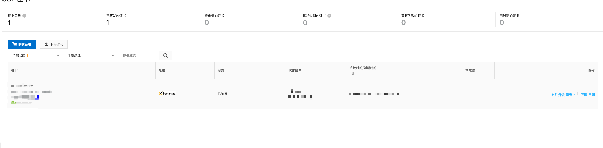

## 如何配置ssl

- #### 购买ssl证书

  - 这里是在[阿里云](https://common-buy.aliyun.com/?spm=5176.2020520163.c1583915649459.d1583915649459_0.74c556a7NQZMq7.74c556a7NQZMq7&commodityCode=cas#/buy)购买;

    

  - 在控制台中搜索ssl可以看到已经购买的证书，进行下载

    

  - 将下载证书放在nginx的 conf 文件夹中，修改配置文件即可; 这里我新建了文件夹 cert

    

- #### nginx配置文件

  - 将nginx的配置文件修改成如下：[nginx.conf](./ssl-nginx.conf)

    主要注意修改:
  
    
  
    
  
  